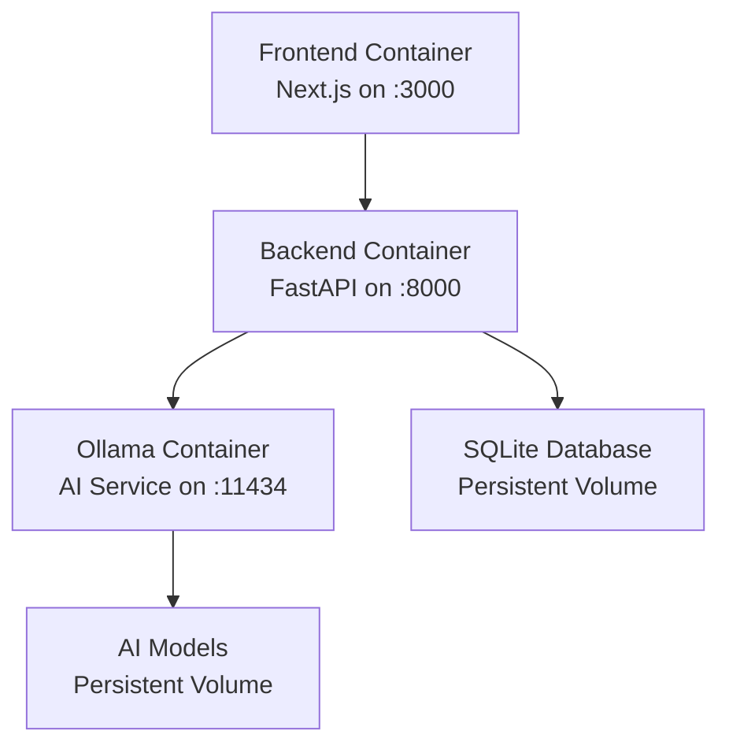

# Docker Setup Guide for Resume-Matcher

This guide provides production-quality Docker configuration for Resume-Matcher, optimized for local development and production deployment.

## 🚀 Quick Start

### Prerequisites

- **Docker** (20.10+) and **Docker Compose** (2.0+)
- **Git** for cloning the repository
- At least **8GB RAM** and **4 CPU cores** (for Ollama AI service)

### Run Production Environment

```bash
# Clone the repository
git clone https://github.com/srbhr/Resume-Matcher.git
cd Resume-Matcher

# Start all services
docker-compose up -d

# View logs (optional)
docker-compose logs -f

# Open the application
# Frontend: http://localhost:3000
# Backend API: http://localhost:8000/api/docs
# Ollama API: http://localhost:11434
```

### Run Development Environment

```bash
# Start development environment with hot-reload
docker-compose -f docker-compose.dev.yml up -d

# View logs
docker-compose -f docker-compose.dev.yml logs -f

# Stop development environment
docker-compose -f docker-compose.dev.yml down
```

## 📁 Docker Files Overview

- `Dockerfile.backend` - Backend FastAPI application container
- `Dockerfile.frontend` - Frontend Next.js application container  
- `docker-compose.yml` - Production deployment configuration
- `docker-compose.dev.yml` - Development environment with hot-reload
- `.dockerignore` - Files excluded from Docker build context

## 🏗️ Architecture



## 🔧 Configuration

### Environment Variables

#### Backend Container
- `PYTHONPATH=/app` - Python module path
- `OLLAMA_URL=http://ollama:11434` - Ollama service URL
- `DATABASE_URL=sqlite:///app/data/app.db` - Database connection
- `ENVIRONMENT=development|production` - Runtime environment
- `DEBUG=true|false` - Debug mode (development only)

#### Frontend Container
- `NODE_ENV=development|production` - Node environment
- `BACKEND_URL=http://backend:8000` - Backend service URL
- `NEXT_TELEMETRY_DISABLED=1` - Disable Next.js telemetry

#### Ollama Container
- `OLLAMA_HOST=0.0.0.0` - Bind to all interfaces

### Port Mappings

| Service  | Container Port | Host Port | Description           |
|----------|---------------|----------|-----------------------|
| Frontend | 3000          | 3000     | Next.js web interface |
| Backend  | 8000          | 8000     | FastAPI REST API      |
| Ollama   | 11434         | 11434    | AI model service      |

### Volume Mounts

#### Production Volumes
- `ollama_data` - Stores AI models and configurations
- `backend_data` - Application data and SQLite database

#### Development Volumes (Additional)
- `./apps/backend:/app` - Backend source code (hot-reload)
- `./apps/frontend:/app` - Frontend source code (hot-reload)

## 🚀 Usage Instructions

### First Time Setup

1. **Start Services**
   ```bash
   docker-compose up -d
   ```

2. **Wait for Initialization**
   - First startup takes 5-10 minutes
   - Ollama downloads AI models automatically
   - Monitor with: `docker-compose logs -f ollama`

3. **Verify Services**
   ```bash
   # Check all services are healthy
   docker-compose ps
   
   # Test endpoints
   curl http://localhost:8000/health
   curl http://localhost:3000
   curl http://localhost:11434/api/version
   ```

### Development Workflow

1. **Start Development Environment**
   ```bash
   docker-compose -f docker-compose.dev.yml up -d
   ```

2. **Edit Code**
   - Backend changes in `apps/backend/` reload automatically
   - Frontend changes in `apps/frontend/` reload automatically

3. **View Logs**
   ```bash
   # All services
   docker-compose -f docker-compose.dev.yml logs -f
   
   # Specific service
   docker-compose -f docker-compose.dev.yml logs -f backend
   ```

### Production Deployment

1. **Build Production Images**
   ```bash
   docker-compose build --no-cache
   ```

2. **Start Production Services**
   ```bash
   docker-compose up -d
   ```

3. **Monitor Health**
   ```bash
   # Check service status
   docker-compose ps
   
   # View application logs
   docker-compose logs -f
   ```

## 🔍 Troubleshooting

### Common Issues

#### Ollama Service Fails to Start
```bash
# Check available memory
free -h

# Increase Docker memory limit (Docker Desktop)
# Settings > Resources > Memory > 8GB+

# Restart Ollama service
docker-compose restart ollama
```

#### Backend Database Errors
```bash
# Check database permissions
docker-compose exec backend ls -la /app/data/

# Reset database
docker-compose down
docker volume rm resume-matcher_backend_data
docker-compose up -d
```

#### Frontend Build Failures
```bash
# Clear build cache
docker-compose down
docker system prune -f
docker-compose build --no-cache frontend
```

#### Port Conflicts
```bash
# Check what's using ports
sudo lsof -i :3000
sudo lsof -i :8000
sudo lsof -i :11434

# Stop conflicting services or modify docker-compose.yml ports
```

### Service Health Checks

All services include health checks:

```bash
# Check health status
docker-compose ps

# View health check logs
docker inspect resume-matcher-backend | grep -A 10 Health
```

### Log Locations

```bash
# Container logs
docker-compose logs backend
docker-compose logs frontend
docker-compose logs ollama

# Follow live logs
docker-compose logs -f --tail=100
```

## 🛡️ Security Features

### Production Security
- Non-root users in all containers
- Minimal base images (Alpine/Slim)
- No unnecessary packages
- Network isolation between services
- Health checks for service monitoring

### Development Security
- Isolated development network
- Volume mounts restricted to source code
- Environment-specific configurations

## ⚡ Performance Optimization

### Resource Allocation
- Backend: 512MB-2GB RAM, 0.5-1 CPU
- Frontend: 256MB-512MB RAM, 0.25-0.5 CPU  
- Ollama: 4GB-8GB RAM, 2-4 CPU (GPU support available)

### Build Optimization
- Multi-stage Docker builds
- Layer caching with BuildKit
- Minimal production images
- Development images with full toolchain

## 🧹 Cleanup Commands

### Stop All Services
```bash
# Production
docker-compose down

# Development  
docker-compose -f docker-compose.dev.yml down
```

### Remove All Data
```bash
# Stop and remove containers, networks, and volumes
docker-compose down -v --remove-orphans

# Remove all images
docker-compose down --rmi all
```

### Complete Reset
```bash
# Stop everything
docker-compose down -v
docker-compose -f docker-compose.dev.yml down -v

# Remove all Resume-Matcher related containers and images
docker system prune -f
docker volume prune -f

# Remove specific volumes
docker volume rm resume-matcher_ollama_data
docker volume rm resume-matcher_backend_data
```

## 📊 Monitoring and Logs

### Service Status
```bash
# Quick status overview
docker-compose ps

# Detailed service info
docker-compose top
```

### Log Management
```bash
# View logs by service
docker-compose logs backend
docker-compose logs frontend  
docker-compose logs ollama

# Follow logs in real-time
docker-compose logs -f

# Last N lines
docker-compose logs --tail=50

# Logs since timestamp
docker-compose logs --since="2024-01-01T00:00:00"
```

### Resource Usage
```bash
# Real-time resource usage
docker stats

# Disk usage
docker system df

# Volume sizes
docker volume ls -q | xargs docker volume inspect | grep Mountpoint
```

## 🤝 Contributing

When contributing to the Docker setup:

1. Test both production and development configurations
2. Update documentation for any configuration changes
3. Verify security best practices
4. Test resource limits on different hardware
5. Validate health checks work correctly

## 🔗 Useful Links

- [Docker Documentation](https://docs.docker.com/)
- [Docker Compose Reference](https://docs.docker.com/compose/)
- [FastAPI Docker Guide](https://fastapi.tiangolo.com/deployment/docker/)
- [Next.js Docker Guide](https://nextjs.org/docs/deployment#docker-image)
- [Ollama Documentation](https://ollama.ai/docs/)

---

**Need Help?** Open an issue on GitHub with:
- Your operating system
- Docker and Docker Compose versions  
- Complete error logs
- Steps to reproduce the issue 